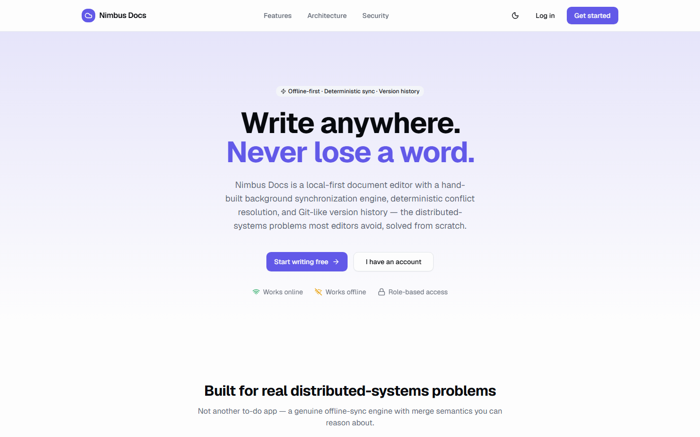
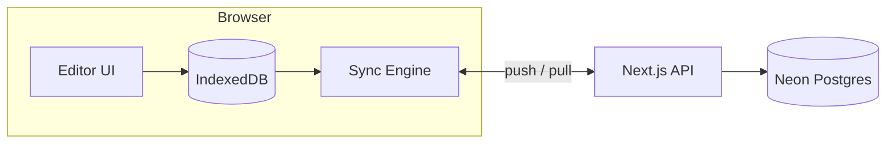
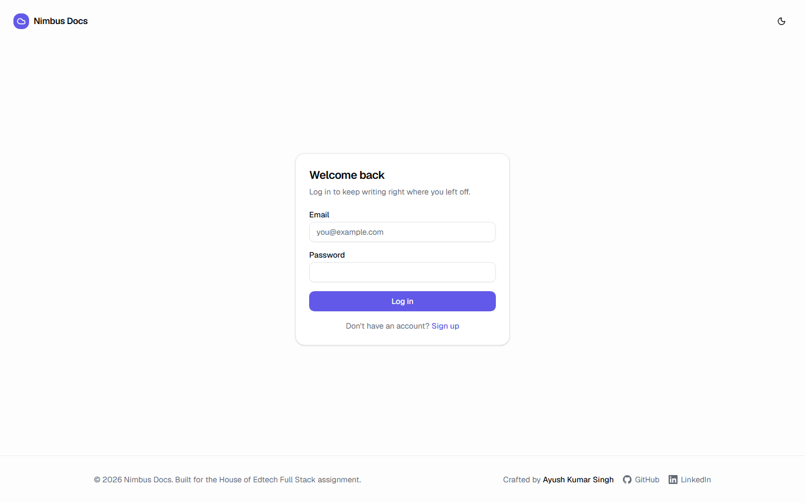
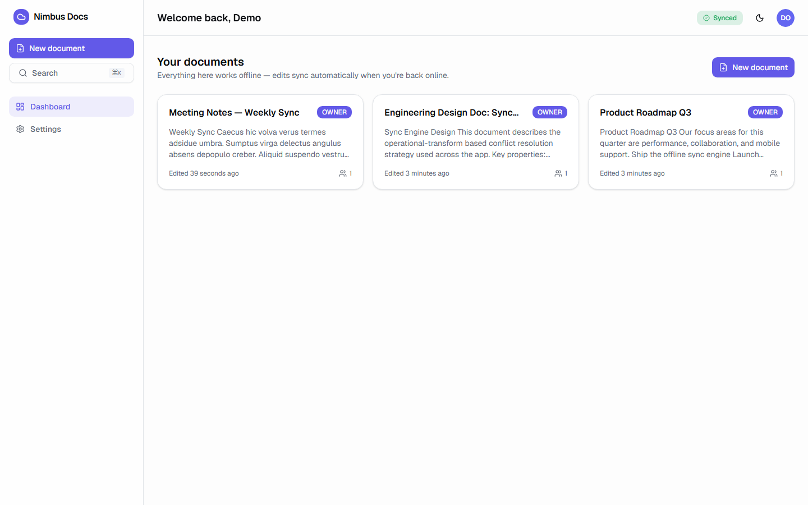
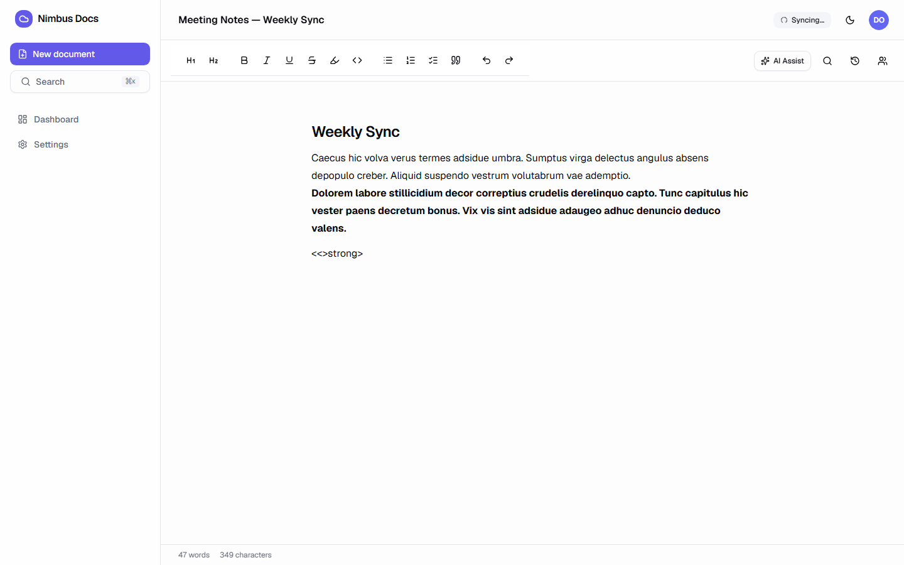
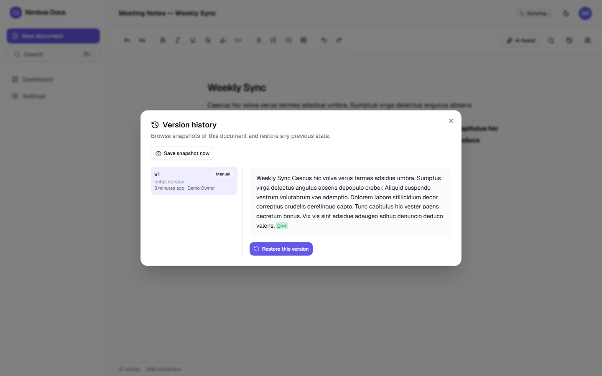
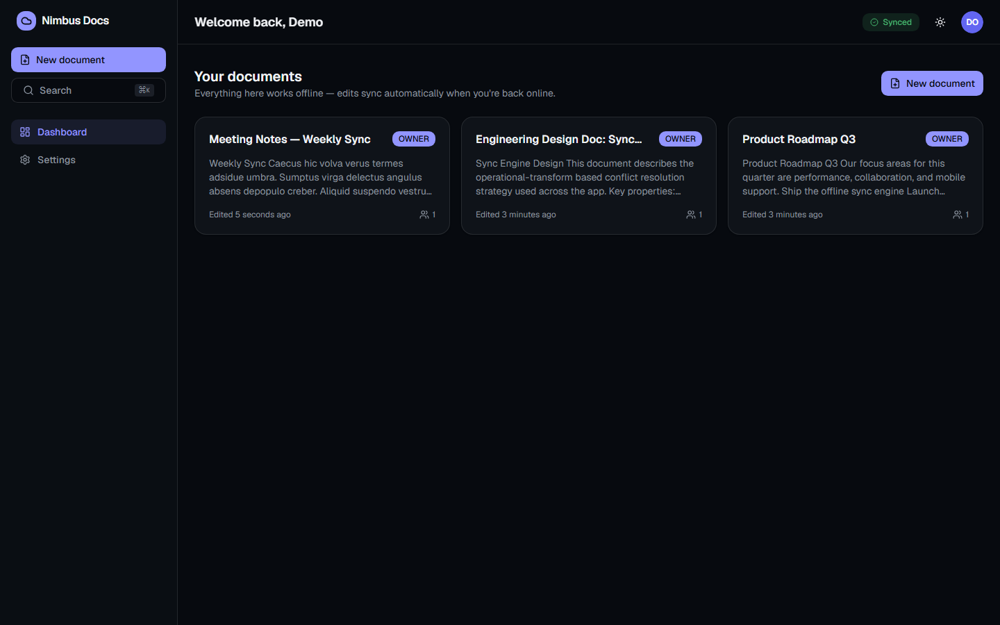
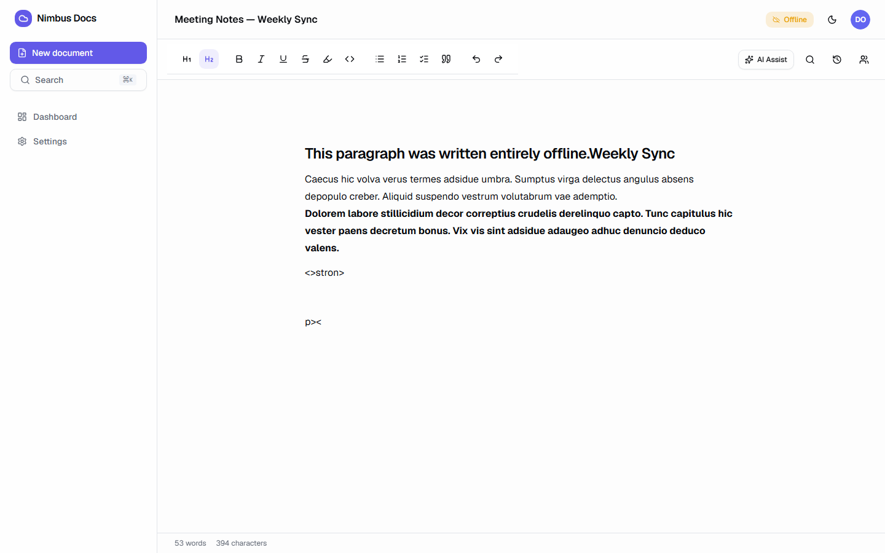
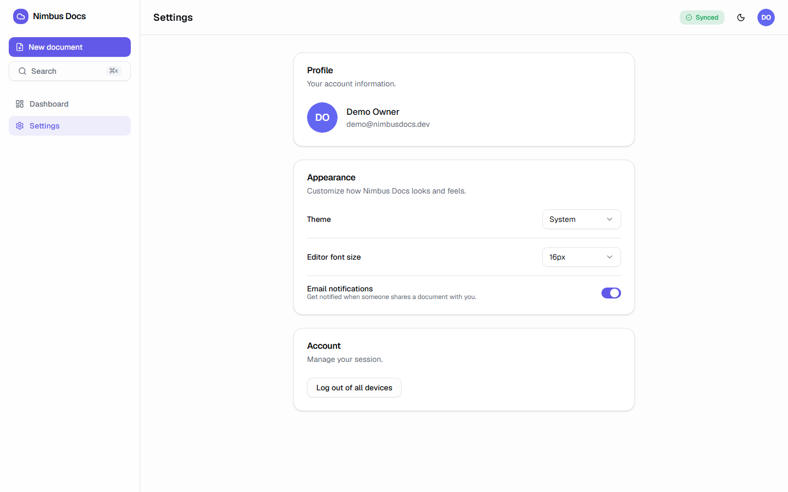
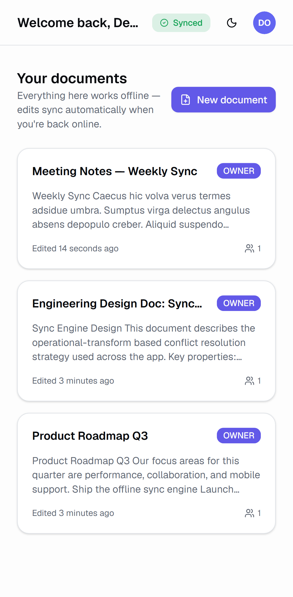

<div align="center">



# Nimbus Docs

**A local-first, offline-capable collaborative document editor with deterministic conflict resolution and Git-like version history.**

Built for the House of Edtech Full Stack Developer assignment — a genuine
distributed-systems take on document editing, not a to-do list.

[](https://github.com/Ayushkumarsingh09/houseofedtech-docedit/actions/workflows/ci.yml)
[](LICENSE)
[](https://nextjs.org)
[](https://www.typescriptlang.org)

[Live Demo](https://houseofedtech-docedit.vercel.app) · [Report a bug](https://github.com/Ayushkumarsingh09/houseofedtech-docedit/issues) · [Documentation](#documentation)

</div>

---

## Overview

Nimbus Docs is a document editor that works **entirely offline** and
reconciles state deterministically once you're back online. Every edit is
written to the browser's IndexedDB first — the network is a background
reconciliation channel, never a blocker. When two people (or two tabs) edit
the same document while disconnected, a hand-built operational-transform
engine merges their changes losslessly once both sides reconnect, and a
Git-like version history lets you browse, diff, and safely restore any past
state.

This is not a CRUD app with a spinner. It is a deliberate exploration of
three hard distributed-systems problems, done from scratch and without any
CRDT/realtime-SaaS library:

1. **Local-first storage** as the actual source of truth, not a cache.
2. **A custom background sync engine** — durable outbox, retry with backoff,
   idempotent operations, cross-tab coordination.
3. **Deterministic, data-loss-averse conflict resolution** for concurrent
   edits, including edits made entirely offline.

## Features

- 📴 **Offline-first** — create, edit, rename, search, undo/redo with zero
  network dependency. No loading spinners blocking input, ever.
- 🔄 **Custom sync engine** — durable outbox queue, exponential backoff +
  jitter, batch push/pull, idempotent replay, BroadcastChannel tab-leader
  election, active connectivity probing (not just `navigator.onLine`).
- 🔀 **Deterministic conflict resolution** — a hand-rolled OT engine
  transforms concurrent insert/delete/replace operations against each
  other with documented, lossless tie-breaking rules. See
  [`docs/ARCHITECTURE.md#conflict-resolution`](docs/ARCHITECTURE.md#conflict-resolution).
- 🕓 **Git-like version history** — automatic + manual snapshots, word-level
  diff view, one-click restore that is itself always reversible.
- 🔐 **JWT auth + RBAC** — Owner / Editor / Viewer roles enforced at the
  repository layer; viewers are structurally unable to push mutations.
- ✍️ **Rich text editor** (Tiptap) — autosave, undo/redo, find & replace,
  word/character counts, keyboard shortcuts, task lists, highlights.
- 🤖 **AI add-ons** — summarize, continue writing, improve clarity — with
  automatic local fallbacks so the app works without any paid API key.
- 🎨 **Premium UI** — command palette (`⌘K`), dark/light/system theme,
  fully responsive, accessible (semantic headings, ARIA live regions,
  keyboard navigable).
- 🛡️ **Security by default** — strict CSP + secure headers, rate limiting,
  size-capped/validated sync payloads, HTML sanitization, audit logging,
  ORM-scoped tenant isolation.
- ✅ **Real automated tests** — Vitest unit + integration tests (including
  a live-database test that runs concurrent multi-client edits and asserts
  a lossless deterministic merge) and Playwright end-to-end tests
  (including a real offline-mode simulation).

## Tech stack

| Layer | Choices |
| --- | --- |
| Framework | Next.js 16 (App Router, Turbopack), React 19, TypeScript (strict) |
| Styling / UI | Tailwind CSS v4, shadcn/ui-style components on Radix UI primitives, `cmdk`, `sonner`, `next-themes` |
| Client state | Zustand, TanStack Query |
| Forms & validation | React Hook Form + Zod (shared schemas client ↔ server) |
| Offline storage | Dexie (IndexedDB), Broadcast Channel API |
| Editor | Tiptap (ProseMirror) |
| Backend | Next.js Route Handlers, Prisma ORM |
| Database | PostgreSQL (Neon, serverless) |
| Auth | JWT (`jose`) + bcrypt, httpOnly rotating-refresh cookies |
| AI | Vercel AI SDK (`ai`, `@ai-sdk/openai`, `@ai-sdk/google`) with local fallbacks |
| Testing | Vitest, React Testing Library, Playwright |
| Tooling | ESLint 9 (flat config), Prettier, Husky, lint-staged, Commitlint |
| Deployment | Vercel + Neon Postgres, GitHub Actions CI |

## Architecture

Full write-up: [`docs/ARCHITECTURE.md`](docs/ARCHITECTURE.md).



## Database

Full schema + ER diagram: [`docs/DATABASE.md`](docs/DATABASE.md). Ten
tables — `users`, `sessions`, `settings`, `documents`, `collaborators`,
`snapshots`, `versions`, `operations`, `audit_logs`, `notifications` — with
indexes, foreign keys, optimistic locking, and transactional writes.

## Folder structure

See [`docs/ARCHITECTURE.md#folder-structure`](docs/ARCHITECTURE.md#folder-structure)
for the full breakdown of `src/app`, `src/features`, `src/lib/sync-engine`,
`src/repositories`, `src/services`, and friends.

## Installation

```bash
git clone https://github.com/Ayushkumarsingh09/houseofedtech-docedit.git
cd houseofedtech-docedit
npm install
cp .env.example .env.local   # fill in the values, see below
npm run db:migrate
npm run db:seed              # optional: demo@nimbusdocs.dev / Password123
npm run dev
```

Open <http://localhost:3000>.

## Environment variables

See [`.env.example`](.env.example) for the full list with comments. At a
minimum you need a Postgres connection string and two random secrets:

```bash
DATABASE_URL="postgresql://..."
DIRECT_URL="postgresql://..."
AUTH_ACCESS_TOKEN_SECRET="$(openssl rand -base64 48)"
AUTH_REFRESH_TOKEN_SECRET="$(openssl rand -base64 48)"
NEXT_PUBLIC_APP_URL="http://localhost:3000"
```

`OPENAI_API_KEY` / `GOOGLE_GENERATIVE_AI_API_KEY` are optional — the AI
features degrade gracefully to local heuristics without them.

## Development

```bash
npm run dev            # Turbopack dev server
npm run db:studio      # Prisma Studio (visual DB browser)
npm run lint:fix       # ESLint with autofix
npm run format         # Prettier
```

## Production

```bash
npm run build
npm run start
```

## Deployment

Full guide: [`docs/DEPLOYMENT.md`](docs/DEPLOYMENT.md). Deployed on
**Vercel** with a **Neon** Postgres database provisioned through Vercel's
storage marketplace integration; every push to `main` deploys
automatically.

## Testing

Full guide: [`docs/TESTING.md`](docs/TESTING.md).

```bash
npm run test            # Vitest: unit + integration
npm run test:coverage   # with coverage report
npm run test:e2e        # Playwright end-to-end (desktop + mobile viewports)
```

69 unit/integration tests and 20 end-to-end test runs (10 specs × 2
viewports) are green in CI on every push. The integration suite runs real
concurrent-edit scenarios against a live Postgres database and asserts the
merge is deterministic and lossless; the e2e suite includes a real
`context.setOffline(true)` simulation of editing without a network.

## Performance

- Route-level code splitting (App Router); heavy editor extensions and AI
  provider SDKs are dynamically imported only when used.
- Debounced diff/hash/persist pipeline keeps typing smooth regardless of
  document size — the editor itself is never blocked by sync work.
- Optimistic UI everywhere (create, rename, type) — the network is always
  a background concern.
- `next/font` self-hosted fonts, security headers configured for caching,
  Tailwind's JIT engine ships only the CSS actually used.

## Security

Threat model and mitigations documented in
[`docs/ARCHITECTURE.md#security`](docs/ARCHITECTURE.md#security):
ORM-scoped tenant isolation, size-capped and Zod-validated sync payloads
(the assignment's "malformed payload OOM" scenario), rate limiting, strict
CSP + secure headers, HTML sanitization, audit logging, rotating refresh
tokens in httpOnly cookies, and role-based authorization enforced
server-side on every mutation.

## Screenshots

| Landing | Authentication |
| --- | --- |
|  |  |

| Dashboard | Editor |
| --- | --- |
|  |  |

| Version History | Dark Mode |
| --- | --- |
|  |  |

| Offline Mode | Settings |
| --- | --- |
|  |  |

| Mobile View |
| --- |
|  |

## Live Demo

- **Live app:** <https://houseofedtech-docedit.vercel.app>
- **GitHub repository:** <https://github.com/Ayushkumarsingh09/houseofedtech-docedit>
- **Demo login:** `demo@nimbusdocs.dev` / `Password123`

## Documentation

| Doc | Contents |
| --- | --- |
| [`docs/ARCHITECTURE.md`](docs/ARCHITECTURE.md) | System design, sync engine, conflict resolution, security, performance, trade-offs |
| [`docs/DATABASE.md`](docs/DATABASE.md) | ER diagram, table reference, indexes, migrations |
| [`docs/API.md`](docs/API.md) | Every route handler, request/response shapes, error codes |
| [`docs/DEPLOYMENT.md`](docs/DEPLOYMENT.md) | Vercel + Neon setup, environment variables, CI/CD |
| [`docs/TESTING.md`](docs/TESTING.md) | What's tested, why, and how to run each layer |
| [`CONTRIBUTING.md`](CONTRIBUTING.md) | Branching, commit conventions, local setup |
| [`CHANGELOG.md`](CHANGELOG.md) | Release history |

## Future improvements

- Compact the operation log into fresh baseline snapshots once a document
  accumulates a very large history (see
  [`docs/ARCHITECTURE.md#real-world-considerations`](docs/ARCHITECTURE.md#real-world-considerations)).
- Swap the in-memory rate limiter for Upstash Redis for true multi-instance
  correctness.
- Add live cursors/presence via a small dedicated realtime gateway, while
  keeping this OT engine as the durable source of truth.
- Structured/rich `contentJson` diffing (currently the OT engine diffs the
  serialized HTML string, which is simple and robust but not
  format-aware).
- Public document sharing (read-only links) and inline comments.

## Assignment requirement mapping

See [`docs/REQUIREMENTS.md`](docs/REQUIREMENTS.md) for a line-by-line
mapping of every requirement in the assignment brief to the exact code that
implements it.

## Beyond the assignment

- A hand-implemented, fully-tested OT engine (not just "last write wins")
  with explicit, documented tie-breaking rules for every operation
  combination.
- Cross-tab sync coordination via the Broadcast Channel API with leader
  election — not required by the brief, but essential for a believable
  "local-first" story with more than one open tab.
- A demo-able AI integration that works with **zero configuration** (local
  fallback heuristics) as well as with a real provider key.
- A command palette, full dark/light/system theming, and mobile-responsive
  layouts validated by a dedicated Playwright project.
- CI that runs against a **real ephemeral Postgres database** (not mocks)
  for both the integration suite and the production build, plus a full
  Playwright run against a production build on every push.
- Automated screenshot generation (`npm run screenshots`) so the README's
  visuals are reproducible, not hand-curated once and left to rot.

## Acknowledgements

- [Next.js](https://nextjs.org), [Prisma](https://www.prisma.io), [Neon](https://neon.tech), [Tiptap](https://tiptap.dev), [Dexie.js](https://dexie.org), [Radix UI](https://www.radix-ui.com), [shadcn/ui](https://ui.shadcn.com) for the excellent foundations this project builds on.
- House of Edtech for a genuinely interesting assignment brief.

## License

[MIT](LICENSE) © 2026 Ayush Kumar Singh

---

<div align="center">

Built by **Ayush Kumar Singh** — [GitHub](https://github.com/Ayushkumarsingh09) · [LinkedIn](https://www.linkedin.com/in/ayush-kumar-singh-a95170256/)

</div>
