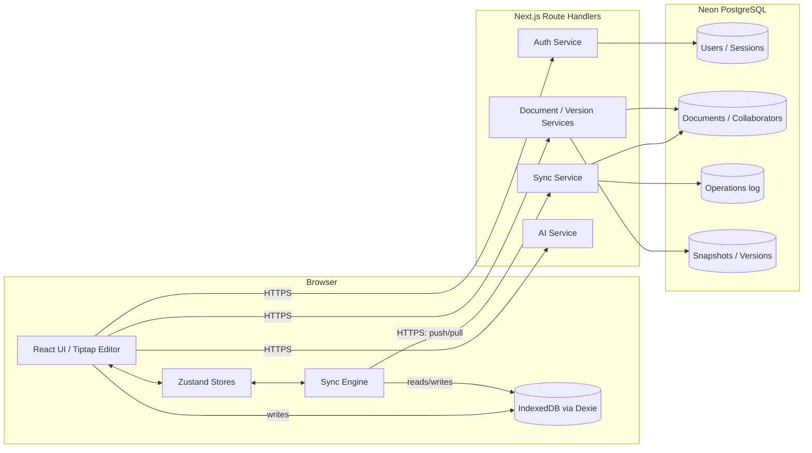

# Architecture

Nimbus Docs is a local-first, offline-capable collaborative document editor.
This document explains the major subsystems, the trade-offs behind them, and
how they fit together.

## Table of contents

- [High-level overview](#high-level-overview)
- [Folder structure](#folder-structure)
- [Local-first data flow](#local-first-data-flow)
- [The synchronization engine](#the-synchronization-engine)
- [Conflict resolution](#conflict-resolution)
- [Version history](#version-history)
- [Authentication & authorization](#authentication--authorization)
- [Security](#security)
- [Performance](#performance)
- [Real-world considerations](#real-world-considerations)

## High-level overview



Every read the UI performs comes from Dexie first — the network is treated
purely as a background reconciliation channel. This is what "local-first"
means in practice: opening, editing, and closing a document never blocks on
connectivity.

## Folder structure

```
src/
  app/                  Next.js App Router routes (pages + API route handlers)
    (marketing)/        Public landing page
    (auth)/             Login / signup pages
    (app)/              Authenticated app shell (dashboard, editor, settings)
    api/                Route handlers (auth, documents, sync, ai, settings)
  components/
    ui/                 Headless, shadcn-style primitives (Button, Dialog, …)
    layout/             App shell chrome (sidebar, topbar, footer, command palette)
    shared/             Small cross-feature components (logo, icons)
    providers/          React context providers (theme, query client, auth hydration)
  features/             Feature-based vertical slices
    auth/                 signup/login forms, hooks, API client
    documents/             dashboard grid, collaborators dialog, hooks, API client
    editor/                Tiptap wrapper, toolbar, search/replace, status bar
    versions/               version timeline, diff view, hooks, API client
    sync/                   sync status indicator, lifecycle hook
    ai/                     AI assist menu, API client
  hooks/                Generic, feature-agnostic hooks (debounce, keyboard shortcuts)
  lib/
    offline/               Dexie database schema (the local source of truth)
    sync-engine/            Conflict resolver, operation queue, network monitor,
                             tab-sync (BroadcastChannel), orchestrator, API client
    prisma.ts, jwt.ts, password.ts, crypto.ts, sanitize.ts, rate-limit.ts,
    errors.ts, api-response.ts, logger.ts, utils.ts
  middlewares/           withAuth / withErrorHandling / rate-limit composition
  repositories/          Prisma data access, always tenant-scoped
  services/              Business logic orchestrating repositories
  schemas/               Zod schemas (single source of truth for shapes)
  validators/             Request parsing/size-guard helpers built on schemas
  stores/                 Zustand stores (auth, sync status, UI)
  types/                  Shared TypeScript types (sync protocol, auth, documents)
  constants/              Centralized magic numbers/strings
  config/                 Validated environment configuration
prisma/                 Schema, migrations, seed script
tests/unit, tests/integration   Vitest suites
e2e/                    Playwright suites
scripts/                One-off maintenance/tooling scripts
docs/                   This documentation + screenshots
```

This is a **feature-based** architecture: UI and hooks specific to a domain
(auth, documents, editor, versions, sync, ai) live together under
`src/features/*`, while framework-agnostic, highly-tested core logic (the
conflict resolver, the operation queue) lives in `src/lib` so it can be unit
tested without any React or Next.js runtime.

## Local-first data flow

1. **Write path.** A keystroke updates the Tiptap editor instantly (pure
   client-side state — no network round trip). A debounced handler
   (`AUTOSAVE_DEBOUNCE_MS`, default 600ms) diffs the previous and next HTML
   strings (`diffToOperations`, backed by the `diff` package) into minimal
   insert/delete/replace payloads, which are immediately persisted to the
   Dexie `outbox` table (`enqueueOperation`). The debounce exists purely to
   avoid hashing/diffing on every keystroke — the *editor* itself never
   waits for it (see [Performance](#performance)).
2. **Read path.** Opening a document reads Dexie first
   (`useDocumentSync`). If this is the very first time the browser has seen
   the document, one network fetch hydrates Dexie; every subsequent visit
   is instant and fully offline-capable.
3. **Reconciliation.** In the background, the sync engine drains the
   outbox to the server and pulls anything that changed remotely, merging
   it in only when it's safe to do so without disturbing in-progress local
   edits (see below).

## The synchronization engine

Source: `src/lib/sync-engine/`.

| Module | Responsibility |
| --- | --- |
| `operation-queue.ts` | Durable, Dexie-backed outbox: enqueue, batch retrieval, idempotency hash, sequence numbering. |
| `network-monitor.ts` | Combines `navigator.onLine` with an active `/api/health` ping (avoids trusting a stale "online" flag on a dead connection). |
| `tab-sync.ts` | BroadcastChannel-based leader election so N open tabs don't all poll the server; every tab still writes locally regardless of leadership. |
| `sync-engine.ts` | Orchestrator: push pending operations → drain outbox on success → pull remote operations → exponential backoff + jitter on failure. |
| `conflict-resolver.ts` | Pure, dependency-free operational-transform functions (see below). Fully unit tested in isolation. |
| `diff-to-operations.ts` | Converts a content diff into the smallest set of insert/delete/replace operations. |
| `api-client.ts` | Thin fetch wrapper for `/api/sync/push` and `/api/sync/pull`, classifying errors as retryable or not. |

**Why not WebSockets?** Real-time push would need a long-lived connection,
which doesn't fit cleanly into Vercel's serverless function model without an
extra always-on process (a separate Node server, or a provider like Pusher/
Ably). Given the assignment explicitly disallows realtime SaaS backends
(Firebase/Supabase Realtime), a short-interval poll (15s) plus
push-on-local-change is a pragmatic, well-understood pattern that still
delivers near-real-time updates without any additional infrastructure. This
is a deliberate, documented trade-off — see
[Real-world considerations](#real-world-considerations) for how this would
evolve with a dedicated realtime layer.

### Idempotency & retry

Every operation carries a client-generated `operationId` (UUID). The
server's `operations` table has a unique index on it, so a retried push
(e.g. after a timeout where the client can't tell if the server received
it) is a safe no-op: the server returns the original result instead of
re-applying the operation.

Failed pushes are retried with exponential backoff
(`SYNC_RETRY_BASE_DELAY_MS × 2^attempt`, capped at `SYNC_RETRY_MAX_DELAY_MS`,
jittered 50–100%) to avoid a thundering herd against the server after an
outage.

## Conflict resolution

Source: `src/lib/sync-engine/conflict-resolver.ts` (100% pure functions,
see `tests/unit/conflict-resolver.test.ts` for the full behavioral spec).

The assignment explicitly disallows CRDT libraries (Yjs, Automerge) and
realtime SaaS backends (Firebase, Supabase Realtime, Liveblocks), so Nimbus
Docs implements a classic **operational transformation** engine by hand,
in the style of early Google Wave / ShareJS servers:

1. Every operation records the `baseVersion` it was authored against.
2. When the server receives a batch, it fetches every operation that has
   landed since the *oldest* `baseVersion` in the batch.
3. Each incoming operation is transformed, in order, against every
   operation that happened after its own `baseVersion` — including
   operations earlier in the very same batch, which are folded into the
   in-memory history as they're applied.
4. The transformed operation is applied to the document, the version
   counter increments, and the operation is durably recorded
   (`status: APPLIED` or `CONFLICT_RESOLVED` if a transform actually
   changed its position/length).
5. The whole read-transform-write cycle is wrapped in an optimistic-
   concurrency retry loop (`UPDATE ... WHERE version = $expected`) — if a
   concurrent request beat it to the write, it re-reads and retries (up to
   5 attempts) rather than silently clobbering the other write.

### Handled cases (see the test suite for exact assertions)

- Concurrent inserts at different / identical positions
- Concurrent deletes with overlapping, nested, and disjoint ranges
- An insert landing inside a concurrent deletion's range — **the inserted
  text is preserved** by shrinking the deletion around it, because Nimbus
  Docs treats "never lose what the user typed" as a harder constraint than
  "a deletion always removes exactly N characters."
- `replace` is decomposed into a delete + insert pair for transformation —
  a standard OT technique — then re-composed.
- Stale operations that predate a full-document overwrite (`set_content`,
  used only by version restore) are **re-anchored to the end of the new
  content** rather than dropped, again prioritizing zero data loss over
  perfect positional fidelity.
- Out-of-order / stale `baseVersion` operations are rejected safely if they
  reference a version that doesn't exist yet, rather than corrupting state.

## Version history

Source: `src/services/version.service.ts`, `prisma/schema.prisma`
(`Snapshot` + `Version` models).

- `Snapshot` rows are immutable content blobs (with a SHA-256 integrity
  hash and byte size).
- `Version` rows are the addressable, orderable pointer/metadata layer
  (label, author, "automatic vs manual", diff stats) — this is the
  Git-like layer: a `Version` is analogous to a commit, a `Snapshot` to the
  tree it points at.
- An automatic snapshot is captured every 25 accepted operations
  (`AUTO_SNAPSHOT_OPERATION_INTERVAL`), bounding how much operation-log
  replay would ever be needed and giving users a meaningful timeline
  without any manual action.
- **Restore** never mutates history destructively: it first snapshots the
  pre-restore state (so a restore is itself always reversible), then
  applies the target content as a new `SET_CONTENT` operation (versioned,
  audit-logged, and broadcast through the normal sync/operation log so
  other connected clients reconcile it like any other change).

## Authentication & authorization

- Passwords hashed with bcrypt (12 rounds).
- Short-lived (15m) access tokens + rotating, longer-lived (30d) refresh
  tokens, both signed with `jose` (Edge-runtime compatible) and stored in
  httpOnly, `SameSite=Lax` cookies — never exposed to client JavaScript.
  The refresh-token cookie is scoped to `/api/auth` only.
- Every refresh **rotates** the token and revokes the old session row,
  so a leaked-but-unused refresh token becomes worthless after first use.
- `proxy.ts` (Next.js 16's successor to `middleware.ts`) does a fast,
  coarse "is there a plausible session cookie" check purely for instant
  redirects; it is **not** the security boundary.
- The real authorization boundary is `src/repositories/access.repository.ts`
  — every document-scoped operation resolves the caller's role
  (`OWNER` / `EDITOR` / `VIEWER`) directly from the database before any
  business logic runs. Nothing queries a document by ID alone.
- Viewers are **structurally** unable to mutate: `pushOperations` and every
  document-mutating service call `assertRole(role, "EDITOR")` before
  touching the sync engine or the database.

## Security

See also: [`docs/DATABASE.md`](DATABASE.md) and [`docs/API.md`](API.md).

- **Tenant isolation / "RLS-equivalent" ORM scoping.** Because connection
  pooling on serverless makes per-request Postgres session variables (the
  usual way to drive native RLS policies) unreliable, Nimbus Docs enforces
  isolation at the ORM layer instead: `accessRepository.getRoleForDocument`
  is the single choke point every service must call, and no other query
  path fetches a document by bare ID.
- **Malformed/oversized payload protection.** `src/schemas/sync.schema.ts`
  caps array lengths (`MAX_BATCH_SIZE = 200`), string lengths
  (`MAX_OPERATION_PAYLOAD_BYTES`, `MAX_DOCUMENT_LENGTH`), and
  `assertBodySize`/`readJsonBody` reject oversized bodies **before** JSON
  parsing is attempted — directly answering the assignment's "how do you
  stop a malformed payload from OOMing your server" question.
- **Rate limiting** on auth, sync, and AI endpoints (in-memory fixed-window
  limiter; documented path to Upstash Redis for a multi-instance
  deployment).
- **XSS.** Rich text is sanitized server-side (`sanitizeHtml`) in addition
  to a strict `Content-Security-Policy` configured in `next.config.ts`.
- **SQL injection.** Eliminated by construction — every query goes through
  Prisma's parameterized query builder; there is no raw SQL string
  concatenation anywhere in the codebase.
- **Audit logging.** Every privileged mutation (`document.create`,
  `collaborator.add`, `version.restore`, `sync.push`, …) is recorded in the
  `audit_logs` table with the actor, target document, and metadata.
- **Secure headers**: `X-Frame-Options: DENY`, `X-Content-Type-Options:
  nosniff`, `Referrer-Policy`, `Permissions-Policy`, HSTS in production.

## Performance

- **Never block on typing.** The editor is fully uncontrolled from React's
  perspective (Tiptap owns its own state); the debounce lives entirely on
  the *diff → enqueue → sync* side effect, not on rendering keystrokes.
- **Memoized store selectors.** Zustand selectors that derive objects use
  `useShallow` to avoid re-render storms.
- Route-level code splitting via the App Router; heavy editor extensions
  and the AI SDK provider packages are dynamically imported only when
  needed.
- `next/font` self-hosts Geist with zero layout shift; images use
  `next/image` conventions where applicable.
- Optimistic UI everywhere: creating a document, renaming, and typing all
  update the UI immediately and reconcile with the server asynchronously.

## Real-world considerations

- **Document size over time.** The full `content` column will not scale
  indefinitely for very large documents edited over years. The `Operation`
  log already gives a natural compaction point: a background job could
  periodically fold operations older than N snapshots into a fresh
  baseline snapshot and prune the operation log beyond it, the same way
  Postgres itself vacuums MVCC tuples. This wasn't necessary at
  assignment scale, but the schema doesn't preclude it.
- **Multi-instance rate limiting / leader election.** The in-memory rate
  limiter and per-tab leader election are scoped to a single browser tab
  and a single serverless instance respectively — both are called out as
  deliberate, cost-conscious choices for this assignment, with a clear
  upgrade path (Upstash Redis; a dedicated realtime coordinator) noted
  inline in the source.
- **Realtime vs. polling.** See [above](#the-synchronization-engine) — a
  15s poll plus push-on-change is the pragmatic choice for a serverless
  deployment; a production SaaS at scale would likely introduce a
  dedicated stateful service (e.g. a small Fly.io/Render WebSocket
  gateway) purely for presence/typing indicators, while keeping this same
  OT engine as the durable source of truth.
