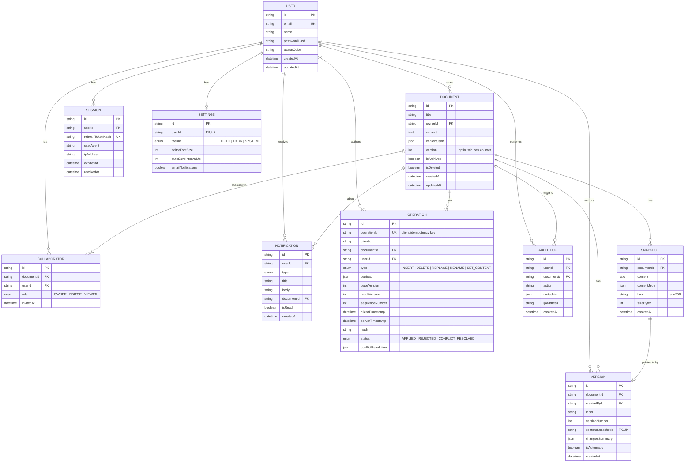

# Database

Nimbus Docs uses **PostgreSQL** (hosted on [Neon](https://neon.tech), serverless
Postgres) via **Prisma ORM**. The full schema lives in
[`prisma/schema.prisma`](../prisma/schema.prisma).

## Entity-relationship diagram



## Table reference

| Table | Purpose |
| --- | --- |
| `users` | Account identity + bcrypt password hash. |
| `sessions` | Hashed refresh tokens for rotation/revocation (never stores the raw token). |
| `settings` | Per-user preferences (theme, editor font size, autosave interval). |
| `documents` | The document aggregate. `version` is the optimistic-locking counter incremented on every accepted mutation. |
| `collaborators` | Many-to-many join between users and documents, carrying the `Role`. |
| `snapshots` | Immutable content blobs, integrity-hashed with SHA-256. |
| `versions` | Git-commit-like pointer to a snapshot, with label/author/diff-stat metadata — this is the user-facing "version history" timeline. |
| `operations` | Append-only log of every accepted sync operation — the audit trail the conflict resolver and pull endpoint rely on. |
| `audit_logs` | Security/observability trail of every privileged action. |
| `notifications` | In-app notifications (e.g. "you were added to a document"). |

## Indexes & constraints

- `documents(ownerId)`, `documents(updatedAt)` — dashboard listing and
  ownership lookups.
- `collaborators(documentId, userId)` **unique** — a user has exactly one
  role per document; also indexed on `userId` for "documents shared with
  me" queries.
- `operations(operationId)` **unique** — idempotency.
- `operations(clientId, documentId, sequenceNumber)` **unique** — detects
  duplicate/out-of-order client sequence numbers.
- `operations(documentId, resultVersion)` — powers the pull endpoint's
  "everything since version N" query.
- `versions(documentId, versionNumber)` **unique** — Git-like monotonic
  numbering per document.
- `snapshots(hash)` — supports future content de-duplication.
- `sessions(refreshTokenHash)` **unique** — O(1) refresh-token lookup
  without ever storing the raw token.
- Every foreign key that represents ownership (`Document.ownerId`,
  `Collaborator.documentId/userId`, `Version.documentId`,
  `Operation.documentId`) cascades on delete so removing a document (or a
  user, where safe) can never leave orphaned rows.

## Optimistic locking & transactions

`documents.version` is the concurrency-control column:

```sql
UPDATE documents
SET version = $newVersion, content = $content, title = $title
WHERE id = $documentId AND version = $expectedVersion;
```

If this affects zero rows, another request already advanced the version —
the sync service re-reads the latest state and retries the whole
transform-and-apply cycle (up to 5 attempts) rather than overwriting the
concurrent write. See `src/services/sync.service.ts`.

Every multi-statement write that must be atomic (creating a version +
snapshot together, restoring a version while snapshotting the pre-restore
state, applying a batch of operations alongside the document version bump)
is wrapped in a Prisma `$transaction`.

## Migrations & seed data

```bash
npm run db:migrate       # prisma migrate dev — create + apply a migration
npm run db:migrate:deploy  # prisma migrate deploy — apply in CI/production
npm run db:seed          # prisma/seed.ts — demo user, documents, and version history
npm run db:studio        # Prisma Studio — browse the database visually
```

Migration history lives in [`prisma/migrations/`](../prisma/migrations/).
